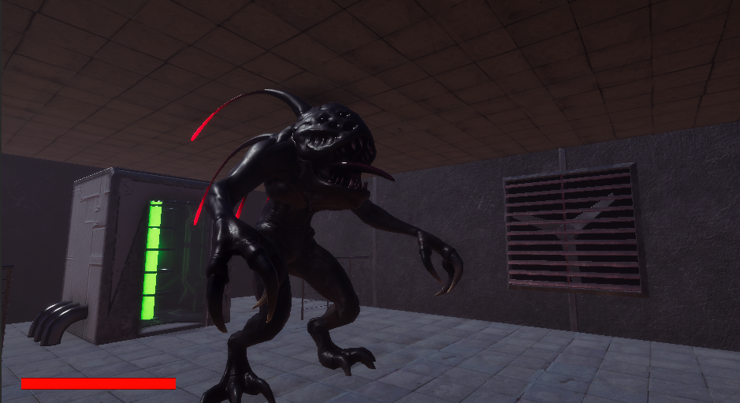
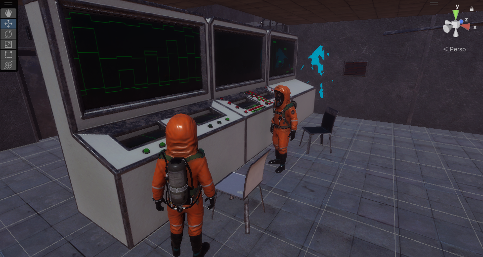
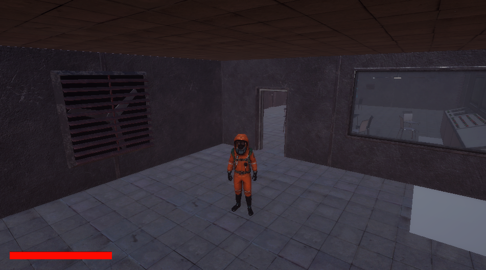
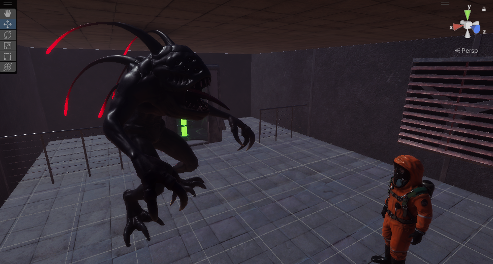

# 프로젝트 소개

- 테마 : SF 스릴러
- 장르 : 3D 멀티 술래잡기 게임
- 시놉시스 : 

*“괴수에게 장악되어 뒤틀린 실험실에서 탈출하라”*

> 이 게임은 정체불명의 괴수에게 장악된 실험실 안에서의 플레이어의 생존을 건 협력 탈출 게임입니다. 함께 단서를 찾아 위협을 파악하고, 독특한 사운드와 어두운 분위기에서 플레이어는 긴장과 공포에 직면하게 됩니다. 괴수의 스킬 사용을 통해 활동영역이 점점 좁아지는 플레이어들은 정해진 시간안에 끊임없이 탈출을 위한 방법을 궁리하게 됩니다. 단독 플레이로는 한계가 있어, 팀원들과 함께 협력하여 이 위험한 실험실을 탈출해야 합니다. 

## 참여 인원

### 팀장

- **20191657 장재만 - 아웃게임 요소 / 매치메이킹**

    - [jmJang00 - Overview](https://github.com/jmJang00)

### 팀원

- **20181602 김태범 - 클라이언트 프레임워크**

    - [scarleter99 - Overview](https://github.com/scarleter99)

- **20213086 조서진 - 맵 디자인 / 맵 장애물 / 맵 상호작용**

    - [kkilme - Overview](https://github.com/kkilme)

- **20203162 함수연 - 플레이어 모션 / 조작 / 아이템 상호작용**

    - [suyeon-ham-01 - Overview](https://github.com/suyeon-ham-01)

- **20191655 장민석 - 적 모션 / 조작**

    - [jangminseok-05 - Overview](https://github.com/jangminseok-05)

- **20212636 송준 - 게임 전반 총 기획 담당**

## 기술 스택

### Client

- Unity (C#)

### Server

- Photon Fusion
- Playfab

### Collaboration

- Github
- Notion
- Slack

## 플랫폼

- 기기: PC
- 해상도: 1920 x 1080

## 프로젝트 진행

- 애자일 방식 (kanban board와 sprint)

- 링크

    - [옮기기 전 프로젝트](https://github.com/KMUGameProgramming/HideNSeek)
    - [프로젝트 관리현황 노션](https://www.notion.so/98b1141f9ad8483fafd8c783eb8fb844?v=b17ecf9e1bc94a27834986dfd7d4ae14)
    - [프로젝트 회의록 노션](https://www.notion.so/4ada763c5f4f47ba85e27a2ed6b53a27?v=115701ea93ca43f9a09e027d7e602572)

## 설치방법 및 데모 실행 방법

- 깃허브 릴리즈

## 프리뷰

