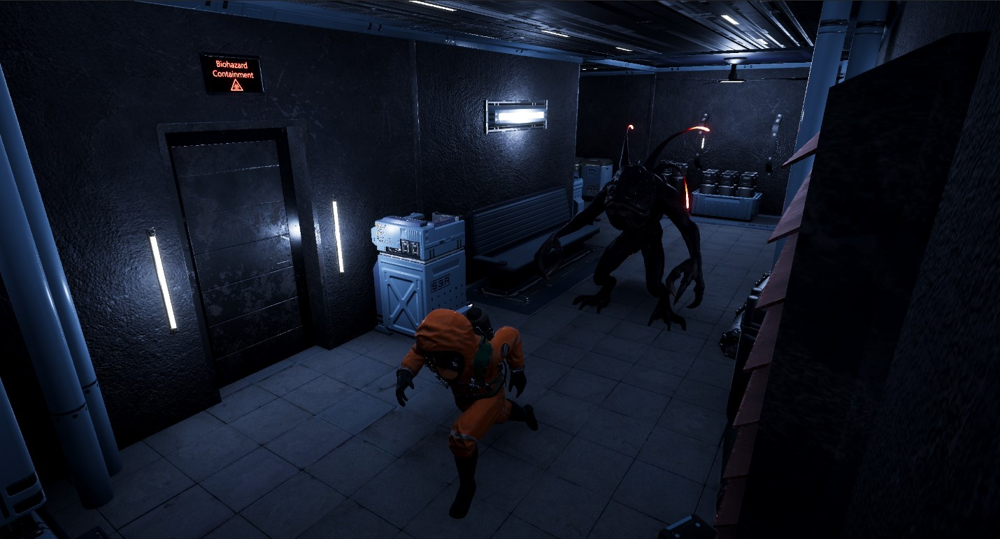
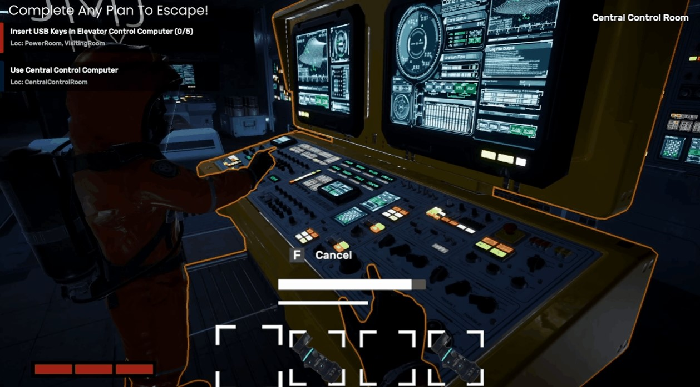
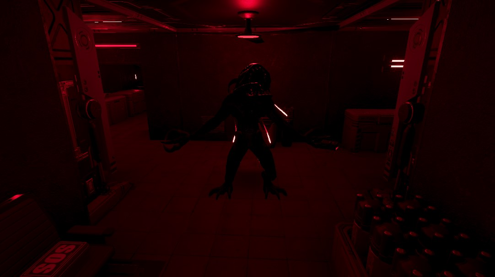

# Face The Abyss

- 주제: 온라인 멀티플레이어 게임
- 장르: FPS, 호러, 1:3 비대칭 PvP
- 테마: Sci-Fi
- 플랫폼: PC(Windows 64bit)
- 플레이 인원: 4인

## 문서
- [수행 결과 보고서, 발표자료, 포스터](https://drive.google.com/drive/folders/1YLPKqJtpWfhtyn0_Kj3BOs8C5MarKasF)

## 시놉시스 

*“정체불명의 괴수에게 장악되어 뒤틀린 시설에서 탈출하라”*

> 이 게임은 3명의 생존자(Crew)와 1명의 괴수(Alien)가 경쟁하는 공포 테마의 비대칭 PvP 게임입니다. 생존자들은 극도의 긴장감 및 공포감 밑에서 괴수가 장악한 시설을 탈출해야 합니다. 괴수는 고유의 능력을 사용하여 시간이 갈수록 생존자들의 숨통을 조여오기 때문에, 너무 늦게 된다면 승리하는 것은 괴수가 될 것입니다. 그러므로 생존자들은 조심스럽게, 동시에 신속하게 목표를 달성해야 하며, 이를 위해서는 협력은 선택이 아닌 필수가 될 것입니다.

## Abstract

*“Escape from a twisted facility seized by unknown creature”*

> This game is a horror-themed asymmetrical multiplayer PvP game in which three survivors - a.k.a *Crews* - and one Creature - a.k.a *Alien* - compete each other. Survivors must escape from the facility under intense tension and fear from the Creature. As time is on the Creature's side, delaying too much will result in defeat for the survivors. Therefore, survivors must achieve their goals cautiously but not slowly, making cooperation not just an option but a necessity.

## 참여 인원

### 팀장

- **20191657 장재만 - Fusion 네트워크, 메뉴 UI 담당**

    - [jmJang00 - Overview](https://github.com/jmJang00)

### 팀원

- **20181602 김태범 - HDRP를 이용한 그래픽, Crew/Alien 컨텐츠, 사운드 담당**

    - [scarleter99 - Overview](https://github.com/scarleter99)

- **20213086 조서진 - 맵 디자인 및 제작, 게임 목표 관련 컨텐츠, 인게임 UI 담당**

    - [kkilme - Overview](https://github.com/kkilme)

- **20203162 함수연 - Crew 컨텐츠, 인게임 UI, 사운드 담당**

    - [suyeon-ham-01 - Overview](https://github.com/suyeon-ham-01)

- **20191655 장민석 - Alien 컨텐츠, 인게임 UI 담당**

    - [jangminseok-05 - Overview](https://github.com/jangminseok-05)

- **20212636 송준 - 프로젝트 기획 담당**

## 기술 스택

#### ✔️Client

#### ✔️Server

#### ✔️Collaboration

## 설치 방법

- [깃허브 릴리즈](https://github.com/kookmin-sw/capstone-2024-10/releases/tag/v1.0.0)

## 프로젝트 진행

- [프로젝트 관리현황 - 노션](https://www.notion.so/98b1141f9ad8483fafd8c783eb8fb844?v=b17ecf9e1bc94a27834986dfd7d4ae14)
- [프로젝트 회의록 - 노션](https://www.notion.so/4ada763c5f4f47ba85e27a2ed6b53a27?v=115701ea93ca43f9a09e027d7e602572)
- [프로젝트 보고서, 발표자료, 포스터](https://drive.google.com/drive/folders/1YLPKqJtpWfhtyn0_Kj3BOs8C5MarKasF)

## 시연 영상

- [최종 - 유튜브](https://youtu.be/5T9ZN6I3MyI) 
- [아이템 - 유튜브](https://www.youtube.com/watch?v=TFiCZCVrkcs)

## 포스터

## 프로젝트 진행

- [프로젝트 관리현황 - 노션](https://www.notion.so/98b1141f9ad8483fafd8c783eb8fb844?v=b17ecf9e1bc94a27834986dfd7d4ae14)
- [프로젝트 회의록 - 노션](https://www.notion.so/4ada763c5f4f47ba85e27a2ed6b53a27?v=115701ea93ca43f9a09e027d7e602572)
- [프로젝트 보고서, 발표자료, 포스터](https://drive.google.com/drive/folders/1YLPKqJtpWfhtyn0_Kj3BOs8C5MarKasF)

## 설치방법 및 데모 실행 방법

- [깃허브 릴리즈](https://github.com/kookmin-sw/capstone-2024-10/releases/tag/v1.0.0)

## 프리뷰

