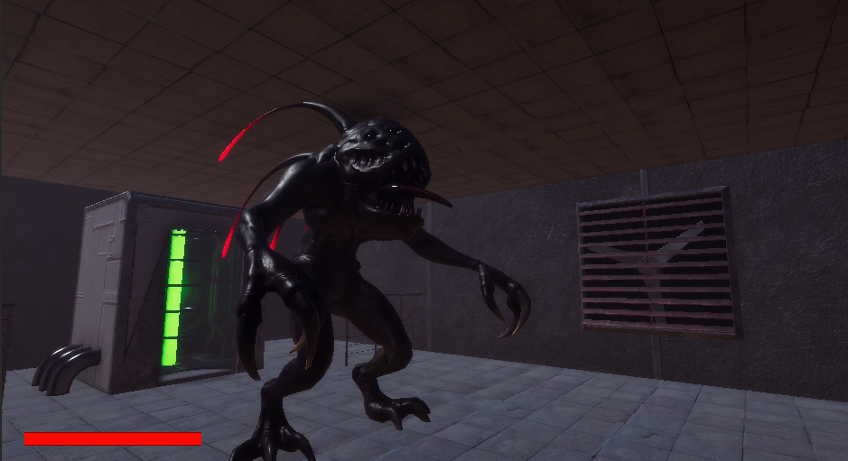
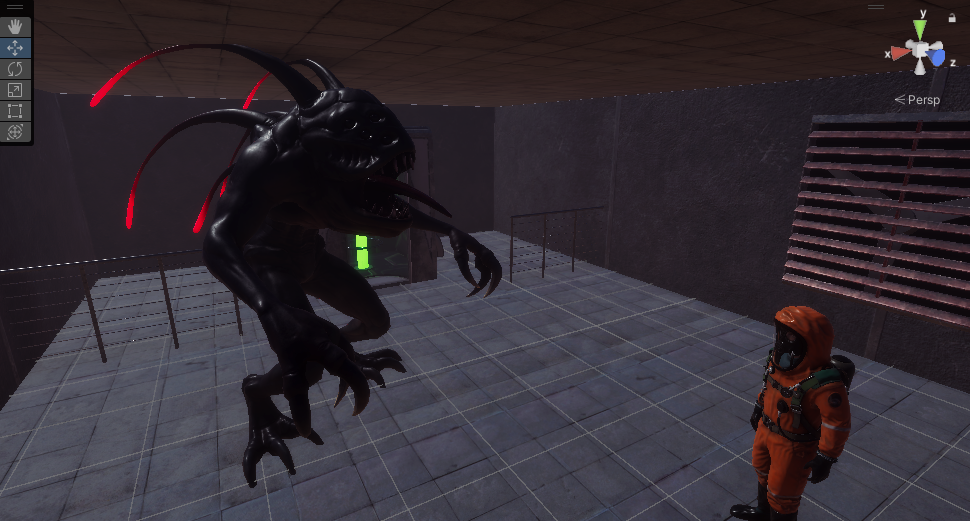

# 프로젝트 소개

- 테마 : SF 스릴러
- 장르 : 3D 비대칭 PVP 공포 게임
- 시놉시스 : 

*“괴수에게 장악되어 뒤틀린 실험실에서 탈출하라”*

> 이 게임은 3명의 생존자와 1명의 괴수가 경쟁하는 공포 테마의 비대칭 PVP 게임입니다. 생존자들은 괴수와 여러 시각적 효과들로부터 오는 극도의 긴장감 및 공포감 밑에서 실험실을 탈출해야 합니다. 괴수는 능력을 사용하여 시간이 갈수록 생존자들의 숨통을 조여오기 때문에, 너무 늦게 된다면 승리하는 것은 괴수가 될 것입니다. 그러므로 생존자들은 조심스럽지만 동시에 신속하게 목표를 달성해야 하며, 이를 위해서는 협력은 선택이 아닌 필수가 될 것입니다.

# Abstract

*“Escape from a twisted laboratory seized by unknown creature”*

> This game is a horror-themed asymmetrical multiplayer game where three *Surviors* and one *Creature* compete each other. Surviors must escape from the laboratory under intense tension and fear from the Creature. As time is on the Creature's side, delaying too much will result in defeat for the survivors. Therefore, survivors must achieve their goals cautiously but not too slowly, making cooperation not just an option but a necessity.

## 참여 인원

### 팀장

- **20191657 장재만 - 아웃게임 요소 / 매치메이킹**

    - [jmJang00 - Overview](https://github.com/jmJang00)

### 팀원

- **20181602 김태범 - 클라이언트 프레임워크**

    - [scarleter99 - Overview](https://github.com/scarleter99)

- **20213086 조서진 - 맵 디자인 / 맵 장애물 / 맵 상호작용**

    - [kkilme - Overview](https://github.com/kkilme)

- **20203162 함수연 - 플레이어 모션 / 조작 / 아이템 상호작용**

    - [suyeon-ham-01 - Overview](https://github.com/suyeon-ham-01)

- **20191655 장민석 - 적 모션 / 조작**

    - [jangminseok-05 - Overview](https://github.com/jangminseok-05)

- **20212636 송준 - 게임 전반 총 기획 담당**

## 기술 스택

### Client

- Unity (C#)

### Server

- Photon Fusion
- Playfab

### Collaboration

- Github
- Notion
- Slack

## 플랫폼

- 기기: PC
- 해상도: 1920 x 1080

## 프로젝트 진행

- 애자일 방식 (kanban board와 sprint)

- 링크

    - [옮기기 전 프로젝트](https://github.com/KMUGameProgramming/HideNSeek)
    - [프로젝트 관리현황 노션](https://www.notion.so/98b1141f9ad8483fafd8c783eb8fb844?v=b17ecf9e1bc94a27834986dfd7d4ae14)
    - [프로젝트 회의록 노션](https://www.notion.so/4ada763c5f4f47ba85e27a2ed6b53a27?v=115701ea93ca43f9a09e027d7e602572)

## 설치방법 및 데모 실행 방법

- 깃허브 릴리즈

## 프리뷰

